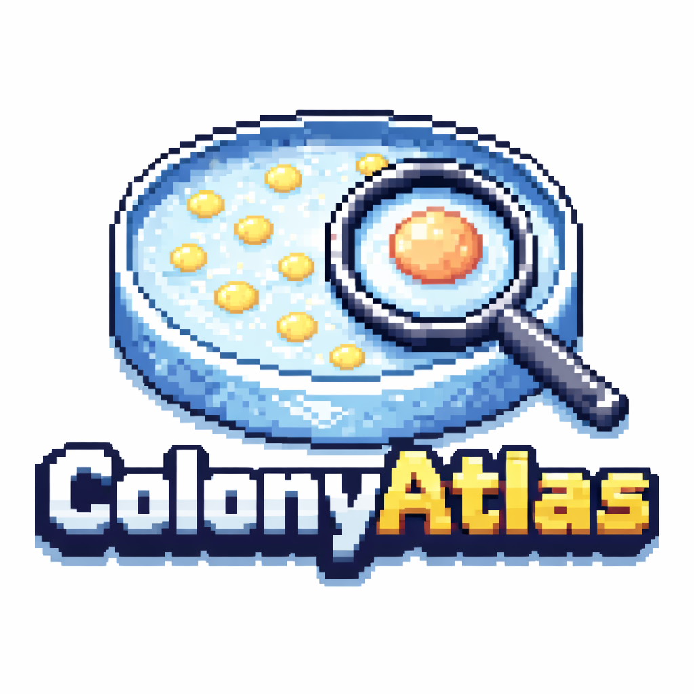

# ColonyAtlas



Interactive morphology analysis for bacterial colony plates. ColonyAtlas lets you upload plate images, run automated segmentation, inspect colonies, visualize metrics, and export reports.

## What this does

- Upload one or more plate images
- Run segmentation to identify colonies
- Compute per‑colony morphology metrics
- Explore results in an interactive dashboard
- Export CSV, Markdown, or PDF reports with plots and overlays

## Architecture

- Frontend: Next.js + React + Tailwind
- Backend: FastAPI (Python)
- Segmentation: YOLO‑seg (default), with mask overlays and outlines

## Requirements

- Python 3.9+ (for backend)
- Node.js 18+ (for frontend)
- (Optional) CUDA + PyTorch for GPU acceleration

## Quickstart (local)

Backend:

```bash
cd backend
python -m venv .venv
. .venv/Scripts/activate
pip install -r requirements.txt
python ..\\run_backend.py
```

Frontend:

```bash
cd frontend
npm install
npm run dev
```

Open:

- Frontend: http://localhost:3000
- Backend API docs: http://localhost:8000/docs

## How to use

1. Open the app and click **Get Started**.
2. Upload a plate image.
3. Enter plate details (diameter, species, treatment, notes).
4. Click **Segment Plates**.
5. Explore the dashboard (viewer, inspector, plots).
6. Export CSV or PDF/Markdown reports.

## Configuration

Environment variables (backend):

- `YOLO_MODEL_PATH`: path to the colony segmentation weights
- `SEGMENTATION_METHOD`: `yolo` (default) or `cellpose`
- `PLATE_MODEL_PATH`: path to plate detector weights
- `CELLPOSE_MODEL_TYPE`: cellpose model type (if using cellpose)

Defaults are set in `backend/main.py`.

## Development notes

- Reports are generated on demand at `/report/plate/{plate_id}`.
- Plate data is in‑memory for MVP (restart clears data).

See `docs/DEV.md` for additional details.
